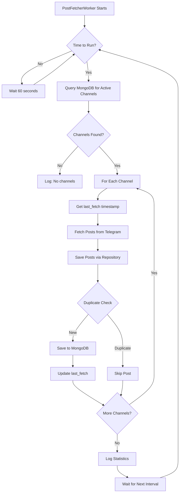
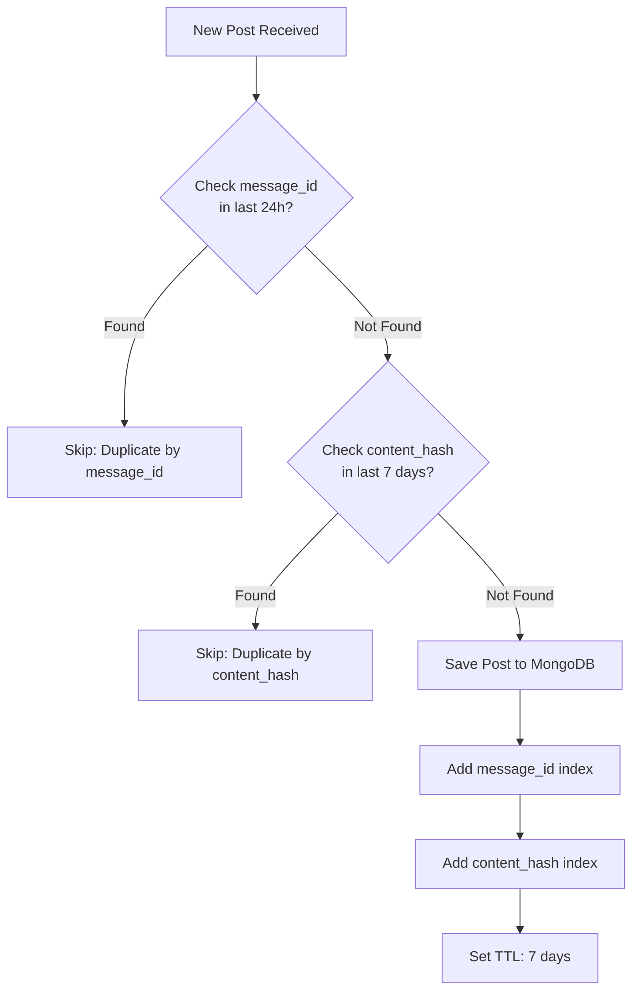
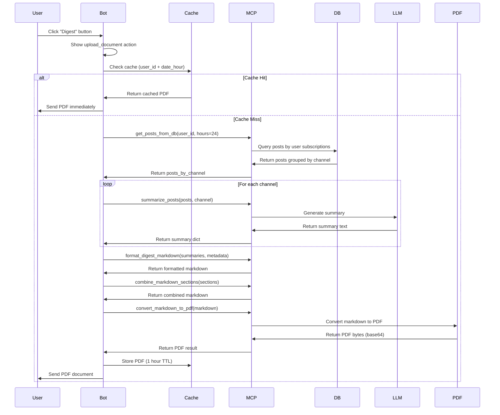
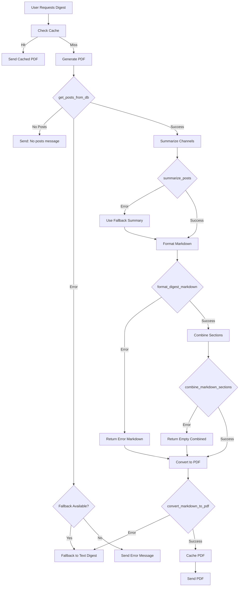
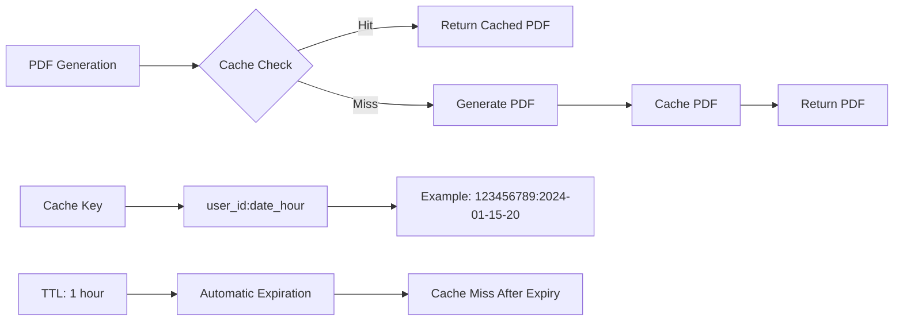
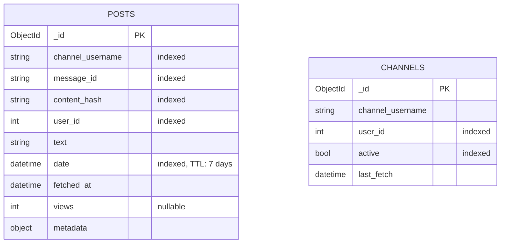
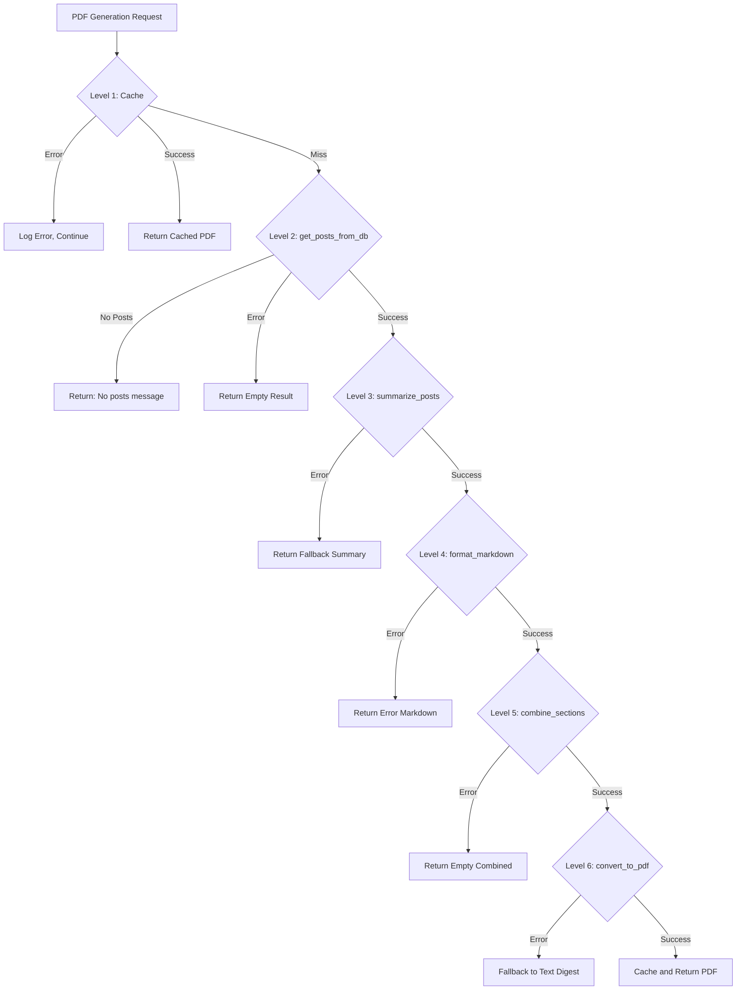
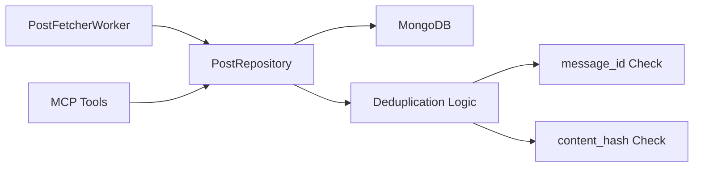
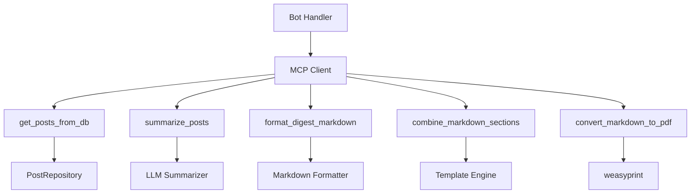
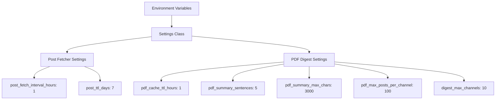

# Day 12 - PDF Digest Architecture Documentation

## Overview

This document describes the architecture of the PDF Digest system, including post collection workflow, PDF generation flow, caching strategy, error handling, and database schema.

## System Architecture

### High-Level Overview

```
┌─────────────────┐
│  Telegram Bot   │
│   (User Input)   │
└────────┬─────────┘
         │
         ▼
┌─────────────────┐
│  Bot Handler    │
│ callback_digest  │
└────────┬─────────┘
         │
         ├──► Cache Check
         │    ├─ Hit: Return cached PDF
         │    └─ Miss: Generate PDF
         │
         ▼
┌─────────────────┐
│   MCP Client    │
│  (Tool Calls)   │
└────────┬─────────┘
         │
         ├──► get_posts_from_db
         ├──► summarize_posts (per channel)
         ├──► format_digest_markdown
         ├──► combine_markdown_sections
         └──► convert_markdown_to_pdf
         │
         ▼
┌─────────────────┐
│   MongoDB       │
│  (Post Storage) │
└─────────────────┘
```

## Post Collection Flow

### Hourly Collection Process



### Deduplication Strategy



**Hybrid Deduplication:**
1. **Primary check**: `message_id` + `channel_username` (24h window) - Fast lookup
2. **Secondary check**: `content_hash` (SHA256) (7-day window) - Catches edits/reposts

## PDF Generation Flow

### Complete Workflow



### Error Handling Flow



## Caching Strategy

### Cache Architecture



**Cache Key Format:**
```
digest_pdf:{user_id}:{date_hour}
Example: digest_pdf:123456789:2024-01-15-20
```

**Cache Implementation:**
- In-memory cache (simple, fast)
- TTL: 1 hour (configurable via `pdf_cache_ttl_hours`)
- User-specific keys
- Automatic expiration check on get

**Cache Benefits:**
- Instant PDF delivery on cache hit
- Reduced MCP tool calls
- Lower LLM usage
- Improved user experience

## Database Schema

### Posts Collection



**MongoDB Schema:**

```json
{
  "_id": ObjectId("507f1f77bcf86cd799439011"),
  "channel_username": "channel1",
  "message_id": "12345",
  "content_hash": "sha256_hash_here",
  "user_id": 123456789,
  "text": "Post text content",
  "date": ISODate("2024-01-15T20:00:00Z"),
  "fetched_at": ISODate("2024-01-15T20:00:00Z"),
  "views": 100,
  "metadata": {
    "edit_date": null,
    "media_type": null
  }
}
```

**Indexes:**
1. `(channel_username, message_id)` - Fast message_id lookup
2. `(content_hash, date)` - Content hash deduplication
3. `(user_id, date)` - Subscription-based queries
4. `date` - TTL index (7 days expiration)

**TTL (Time To Live):**
- Posts expire after 7 days automatically
- MongoDB automatically removes expired documents

## Error Handling Strategy

### Error Recovery Levels



**Error Handling Principles:**
1. **Graceful Degradation**: Never fail completely, always provide fallback
2. **Logging**: All errors logged with context
3. **User-Friendly Messages**: Clear error messages for users
4. **Continue Processing**: Errors in one channel don't stop others

## Component Interactions

### Post Repository



### MCP Tools Integration



## Configuration

### Settings Hierarchy



## Performance Considerations

### Optimization Strategies

1. **Caching**: PDFs cached for 1 hour to reduce regeneration
2. **Indexes**: MongoDB indexes for fast queries
3. **Limits**: Post and channel limits prevent token overflow
4. **Async Processing**: All operations are async for better concurrency
5. **Deduplication**: Hybrid deduplication prevents duplicate processing

### Resource Usage

- **Memory**: In-memory cache for PDFs (configurable size)
- **Database**: MongoDB with TTL indexes for automatic cleanup
- **CPU**: PDF generation uses weasyprint (moderate CPU usage)
- **Storage**: Posts stored for 7 days, then auto-deleted

## Monitoring and Metrics

### Key Metrics (Future Implementation)

- `post_fetcher_posts_saved_total` (Counter)
- `post_fetcher_channels_processed_total` (Counter)
- `post_fetcher_errors_total` (Counter)
- `post_fetcher_duration_seconds` (Histogram)
- `pdf_generation_duration_seconds` (Histogram)
- `pdf_generation_errors_total` (Counter)
- `pdf_file_size_bytes` (Histogram)
- `bot_digest_requests_total` (Counter)
- `bot_digest_cache_hits_total` (Counter)
- `bot_digest_errors_total` (Counter)

## Security Considerations

1. **User Isolation**: Each user only sees their own posts
2. **Input Validation**: All inputs validated before processing
3. **Error Sanitization**: Error messages don't expose internal details
4. **Cache Keys**: User-specific cache keys prevent cross-user access

## Future Improvements

1. **Redis Cache**: Replace in-memory cache with Redis for multi-instance deployment
2. **PDF Templates**: Support for custom PDF templates
3. **Batch Processing**: Optimize for bulk PDF generation
4. **Metrics**: Prometheus metrics integration (Phase 8)
5. **Health Checks**: Worker health check endpoints (Phase 8)

## Related Documentation

- [API Documentation](api.md) - MCP tools API reference
- [User Guide](USER_GUIDE.md) - User-facing documentation
- [Phase Summary](../tasks/day_12/day_12-phase-06-summary.md) - Implementation summary

