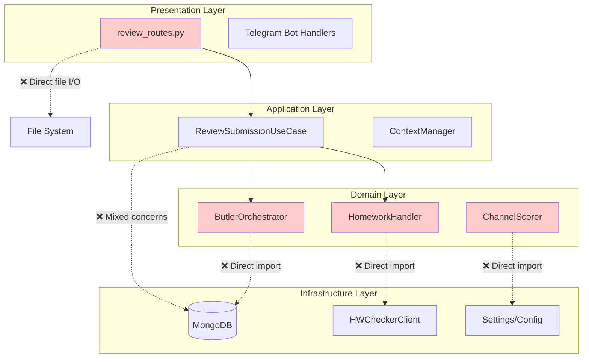
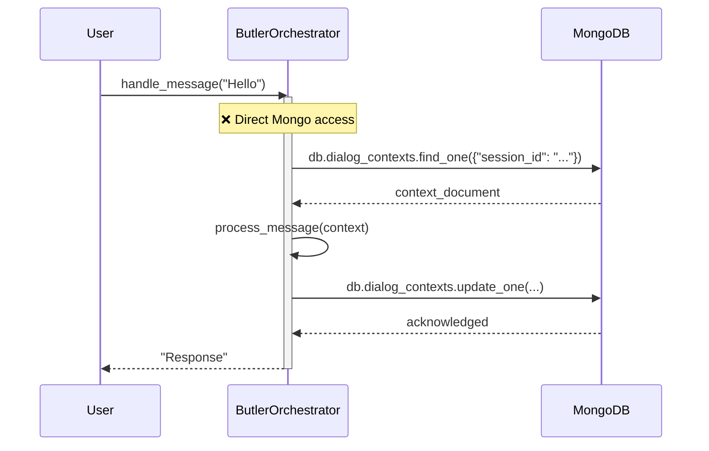
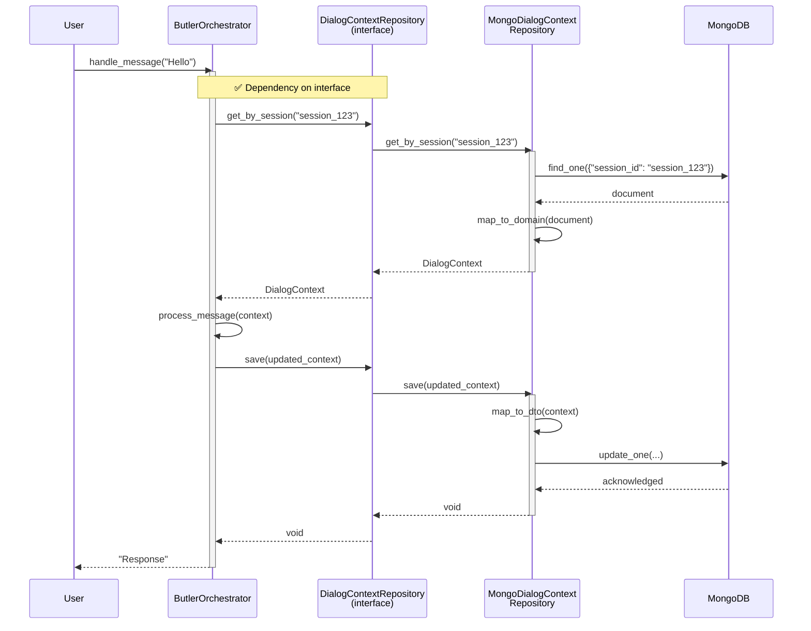
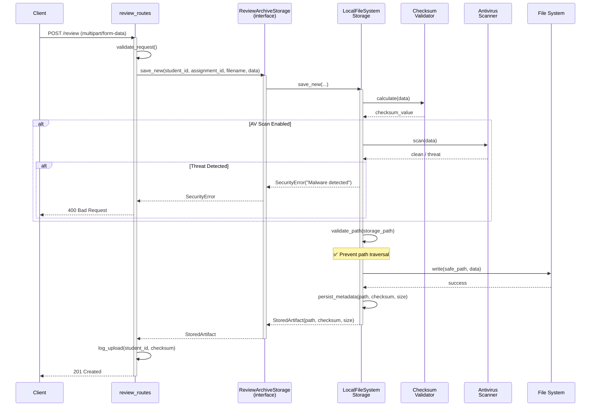
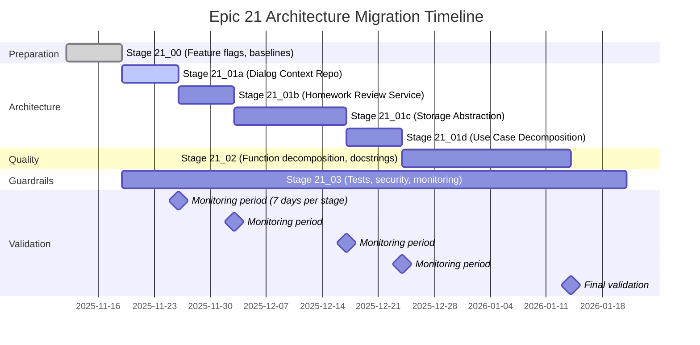
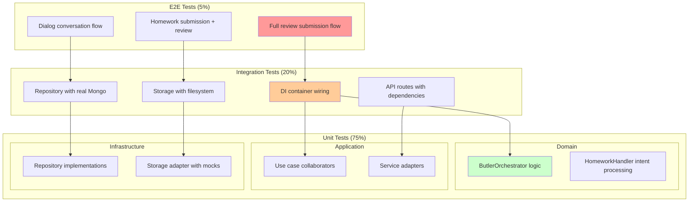
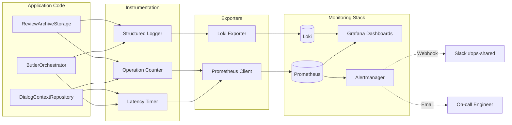

# Epic 21 · Architecture Diagrams

**Purpose**: Visual representation of architecture transformation from current state
to target Clean Architecture compliance.

---

## Diagram 1: Current State (Violations)

### Layer Dependencies (Current)



**Legend**:
- 🟢 Solid arrows = correct dependencies (outer → inner)
- 🔴 Dotted arrows = violations (inner → infrastructure)
- Red boxes = modules with violations

---

## Diagram 2: Target State (Clean Architecture)

### Layer Dependencies (Target)

```mermaid
graph TD
    subgraph "Presentation Layer"
        Routes[review_routes.py]
        BotHandlers[Telegram Bot Handlers]
        DIContainer[DI Container]
    end
    
    subgraph "Application Layer"
        UseCase[ReviewSubmissionUseCase]
        StorageService[Storage Service]
        HWService[HomeworkReviewService]
    end
    
    subgraph "Domain Layer"
        Butler[ButlerOrchestrator]
        HWHandler[HomeworkHandler]
        
        subgraph "Domain Interfaces"
            IDialogRepo[DialogContextRepository]
            IHWService[HomeworkReviewService]
            IConfig[ChannelResolutionConfig]
        end
    end
    
    subgraph "Application Interfaces"
        IStorage[ReviewArchiveStorage]
    end
    
    subgraph "Infrastructure Layer"
        MongoRepo[MongoDialogContextRepository]
        HWAdapter[HWCheckerServiceAdapter]
        LocalStorage[LocalFileSystemStorage]
        ConfigImpl[ConfigProvider]
        Mongo[(MongoDB)]
        HWClient[HWCheckerClient]
    end
    
    %% Presentation → Application
    Routes --> StorageService
    Routes --> UseCase
    DIContainer --> Routes
    
    %% Application → Domain
    UseCase --> Butler
    UseCase --> HWHandler
    StorageService --> IStorage
    HWService --> IHWService
    
    %% Domain → Interfaces (dependency inversion)
    Butler --> IDialogRepo
    HWHandler --> IHWService
    
    %% Infrastructure → Interfaces (implements)
    MongoRepo -.->|implements| IDialogRepo
    HWAdapter -.->|implements| IHWService
    LocalStorage -.->|implements| IStorage
    ConfigImpl -.->|implements| IConfig
    
    %% Infrastructure → External
    MongoRepo --> Mongo
    HWAdapter --> HWClient
    LocalStorage --> Disk[File System]
    
    %% DI wiring
    DIContainer -.->|injects| MongoRepo
    DIContainer -.->|injects| HWAdapter
    DIContainer -.->|injects| LocalStorage
    
    style Butler fill:#ccffcc
    style HWHandler fill:#ccffcc
    style Routes fill:#ccffcc
    style IDialogRepo fill:#cce5ff
    style IHWService fill:#cce5ff
    style IStorage fill:#cce5ff
```



**Legend**:
- 🟢 Solid arrows = dependencies (always outer → inner or impl → interface)
- 🔵 Blue boxes = interfaces (protocols)
- 🟢 Green boxes = compliant modules (no violations)
- Dotted arrows = "implements" relationship

---

## Diagram 3: Component Interaction (Dialog Context Example)

### Before: Direct MongoDB Access



### After: Repository Abstraction



**Benefits**:
- Butler doesn't know about MongoDB
- Repository can be swapped (e.g., InMemory for tests)
- Clear boundary between domain logic and persistence

---

## Diagram 4: Storage Abstraction (Security Focus)

### File Upload Flow with Adapter



**Security Controls**:
1. Checksum calculation (integrity)
2. Optional AV scan (malware detection)
3. Path validation (prevent traversal)
4. Metadata persistence (audit trail)

---

## Diagram 5: Dependency Injection Wiring

### Container Configuration

```mermaid
graph LR
    subgraph "DI Container"
        Container[DIContainer]
        
        subgraph "Singleton Services"
            MongoClient[MongoDB Client]
            LLMClient[LLM Client]
            PrometheusClient[Prometheus Client]
        end
        
        subgraph "Factory Providers"
            DialogRepoFactory[DialogContextRepository<br/>Factory]
            HWServiceFactory[HomeworkReviewService<br/>Factory]
            StorageFactory[ReviewArchiveStorage<br/>Factory]
        end
        
        subgraph "Application Services"
            ButlerFactory[ButlerOrchestrator<br/>Factory]
            UseCaseFactory[ReviewSubmissionUseCase<br/>Factory]
        end
    end
    
    subgraph "Configuration"
        EnvVars[Environment Variables]
        Settings[Settings Model]
    end
    
    subgraph "Implementations"
        MongoRepo[MongoDialogContextRepository]
        HWAdapter[HWCheckerServiceAdapter]
        LocalStorage[LocalFileSystemStorage]
    end
    
    %% Configuration flow
    EnvVars --> Settings
    Settings --> Container
    
    %% Singleton dependencies
    Container --> MongoClient
    Container --> LLMClient
    Container --> PrometheusClient
    
    %% Factory wiring
    DialogRepoFactory --> MongoRepo
    HWServiceFactory --> HWAdapter
    StorageFactory --> LocalStorage
    
    MongoClient -.-> MongoRepo
    
    %% Application wiring
    ButlerFactory --> DialogRepoFactory
    ButlerFactory --> LLMClient
    UseCaseFactory --> StorageFactory
    
    %% FastAPI integration
    Routes[FastAPI Routes] --> Container
    Routes -.->|Depends()| ButlerFactory
    Routes -.->|Depends()| UseCaseFactory
```

**Wiring Example** (code):

```python
# src/infrastructure/di/container.py

class DIContainer:
    def __init__(self, settings: Settings):
        self._settings = settings
        self._instances: dict[str, Any] = {}
    
    @cached_property
    def mongo_client(self) -> AsyncIOMotorClient:
        return AsyncIOMotorClient(self._settings.mongodb_url)
    
    @cached_property
    def dialog_context_repo(self) -> DialogContextRepository:
        if self._settings.USE_NEW_DIALOG_CONTEXT_REPO:
            return MongoDialogContextRepository(
                mongo_client=self.mongo_client
            )
        else:
            # Fallback to legacy (for gradual rollout)
            return LegacyMongoAdapter(mongo_client=self.mongo_client)
    
    @cached_property
    def butler_orchestrator(self) -> ButlerOrchestrator:
        return ButlerOrchestrator(
            context_repo=self.dialog_context_repo,  # ← injected interface
            llm_client=self.llm_client,
            prometheus_client=self.prometheus_client
        )

# src/presentation/api/dependencies.py

_container: DIContainer | None = None

def get_container() -> DIContainer:
    global _container
    if _container is None:
        _container = DIContainer(settings=get_settings())
    return _container

# src/presentation/api/routes.py

@router.post("/dialog")
async def handle_dialog(
    message: DialogRequest,
    container: DIContainer = Depends(get_container)
):
    orchestrator = container.butler_orchestrator
    response = await orchestrator.handle_message(message.user_id, message.text)
    return {"response": response}
```

---

## Diagram 6: Migration Path (Stage-by-Stage)

### Progressive Rollout



**Feature Flag States** (over time):

| Week | Dialog Repo | HW Service | Storage | Use Case | Notes |
|------|-------------|------------|---------|----------|-------|
| 1 | ❌ Off | ❌ Off | ❌ Off | ❌ Off | Baseline (Stage 21_00) |
| 2 | ✅ On | ❌ Off | ❌ Off | ❌ Off | 21_01a deployed |
| 3 | ✅ On | ✅ On | ❌ Off | ❌ Off | 21_01b deployed |
| 5 | ✅ On | ✅ On | ✅ On | ❌ Off | 21_01c deployed (2 weeks) |
| 6 | ✅ On | ✅ On | ✅ On | ✅ On | 21_01d deployed |
| 9 | ✅ On | ✅ On | ✅ On | ✅ On | Stage 21_02 complete |
| 10+ | ✅ On | ✅ On | ✅ On | ✅ On | Production stable |

---

## Diagram 7: Test Strategy Pyramid

### Test Coverage by Layer



**Execution Time Budget**:
- Unit tests: <10s (fast feedback)
- Integration tests: <30s (shared infra)
- E2E tests: <2min (full stack)

---

## Diagram 8: Monitoring & Observability

### Metrics Flow



**New Metrics** (Epic 21):

```prometheus
# Dialog Context Repository
dialog_context_repository_operations_total{operation, status}
dialog_context_repository_latency_seconds{operation}

# Homework Review Service
homework_review_service_requests_total{operation, status}
homework_review_service_latency_seconds{operation}

# Storage Adapter
review_archive_storage_bytes_written{backend}
review_archive_storage_operations_total{operation, status}
review_archive_storage_checksum_failures_total

# Use Case Decomposition
review_submission_rate_limit_hits_total
review_submission_log_analysis_duration_seconds
```

---

## Acceptance Criteria

- [ ] All diagrams reviewed by EP21 Tech Lead
- [ ] Target architecture approved by architect
- [ ] Migration path validated with DevOps
- [ ] Test pyramid aligns with testing_strategy.md
- [ ] Monitoring flow covers all new components
- [ ] Diagrams included in Stage 21_01 deliverables

---

## References

- **Clean Architecture**: Robert C. Martin, "Clean Architecture" (book)
- **Mermaid Syntax**: https://mermaid-js.github.io/mermaid/
- **Dependency Inversion**: SOLID principles (`.cursor/rules/cursorrules-unified.md`)

---

**Document Owner**: EP21 Architect  
**Last Updated**: 2025-11-11  
**Next Review**: After Stage 21_00 completion

