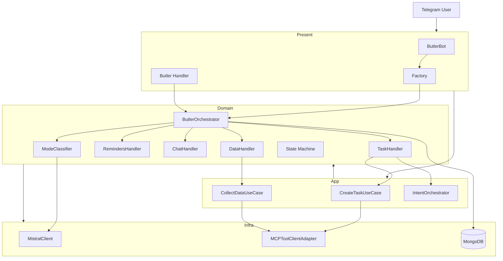
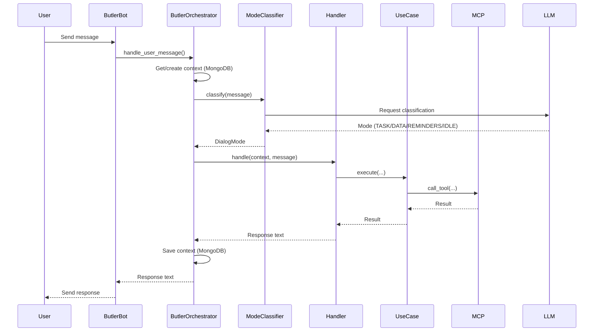
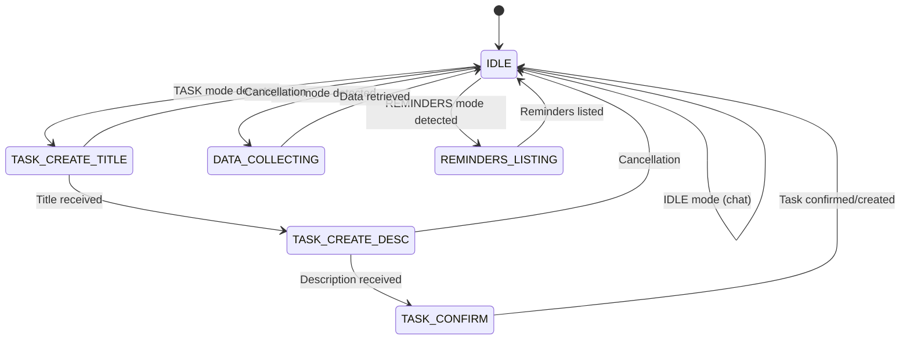

# Architecture Documentation

## Overview

This document describes the Clean Architecture implementation of the AI Challenge project, following SOLID principles and the Zen of Python.

## Architecture Principles

### Clean Architecture Layers

The application is organized into four distinct layers:

1. **Domain Layer** - Core business logic
2. **Application Layer** - Use cases and orchestration
3. **Infrastructure Layer** - External integrations
4. **Presentation Layer** - API and CLI interfaces

### Dependency Flow

```
┌─────────────────────┐
│  Presentation       │  ← User Interface
│  (API, CLI)        │
└──────────┬──────────┘
           │
           ↓
┌─────────────────────┐
│  Application        │  ← Use Cases & Orchestrators
│  (Orchestrators)   │
└──────────┬──────────┘
           │
           ↓
┌─────────────────────┐
│  Domain             │  ← Business Logic
│  (Entities, VO)    │
└──────────┬──────────┘
           │
           ↓
┌─────────────────────┐
│  Infrastructure     │  ← External Services
│  (Clients, Repos)  │
└─────────────────────┘
```

## Domain Layer

### Purpose
Contains the core business logic and entities, independent of external frameworks.

### Components

#### Entities
- `AgentTask` - Task lifecycle management
- `ModelConfig` - Model configuration with validation
- `TokenInfo` - Token counting and analysis

#### Value Objects
- `TaskMetadata` - Immutable task metadata
- `CodeQualityMetrics` - Code quality assessment
- `TokenCount` - Token usage information

#### Services
- `CodeGeneratorAgent` - Code generation logic
- `CodeReviewerAgent` - Code review logic
- `TokenAnalyzer` - Token analysis and compression
- `RiddleEvaluator` - Riddle testing and evaluation

## Application Layer

### Purpose
Implements use cases and orchestrates workflows between domain entities.

### Components

#### Orchestrators
- `MultiAgentOrchestrator` - Sequential multi-agent workflows
- `ParallelOrchestrator` - Concurrent agent execution

#### Use Cases
- `GenerateCodeUseCase` - Code generation workflow
- `ReviewCodeUseCase` - Code review workflow

## Infrastructure Layer

### Purpose
Handles external integrations and implementation details.

### Components

#### Clients
- `SimpleModelClient` - Model API client
- `MultiModelSupport` - Multi-model management

#### Repositories
- `JsonAgentRepository` - JSON-based task storage
- `InMemoryModelRepository` - In-memory model storage

#### Configuration
- `ModelSelector` - YAML-based model selection
- `ExperimentTemplate` - Experiment template loading

## Presentation Layer

### Purpose
Provides user interfaces (API and CLI).

### Components

#### API
- FastAPI endpoints for agent interactions
- RESTful API for workflow management

#### CLI
- Command-line interface for local development
- Interactive mode for testing

## Workers Layer

### Purpose
Background workers for scheduled tasks and notifications.

### Components

#### Summary Worker
Coordinates scheduled notifications for task summaries and channel digests.

**Modular Structure:**
```
src/workers/
├── summary_worker.py    # Main coordinator (258 lines)
├── formatters.py         # Message formatting
├── message_sender.py     # Message sending with retry
└── data_fetchers.py      # Data fetching from MCP/DB
```

**Responsibilities:**
- `summary_worker.py`: Main loop, scheduling, coordination
- `formatters.py`: Format messages (summary, digest, markdown cleanup)
- `message_sender.py`: Send messages with exponential backoff retry
- `data_fetchers.py`: Fetch data from MCP tools or database

**Features:**
- Scheduled morning task summaries
- Scheduled evening channel digests
- Debug mode with configurable intervals
- Quiet hours support
- Graceful shutdown handling

## Design Patterns

### Strategy Pattern
Used in compression algorithms and model selection strategies.

### Factory Pattern
Used for creating agents and orchestrators with different configurations.

### Repository Pattern
Used for data persistence abstraction.

### Observer Pattern
Used for workflow event handling and metrics collection.

## SOLID Principles

### Single Responsibility
Each class has one clear responsibility.

### Open/Closed
Open for extension, closed for modification.

### Liskov Substitution
Subclasses can replace parent classes without breaking functionality.

### Interface Segregation
Small, focused interfaces rather than large monolithic ones.

### Dependency Inversion
High-level modules depend on abstractions, not implementations.

## Architecture Benefits

### Testability
- Each layer can be tested independently
- Dependency injection enables easy mocking
- High test coverage (70%+)

### Maintainability
- Clear separation of concerns
- Easy to understand and modify
- Reduced coupling between components

### Scalability
- Easy to add new agents
- Plug-and-play architecture
- Configuration-driven behavior

### Portability
- Domain layer is framework-agnostic
- Easy to swap infrastructure components
- Platform-independent business logic

## Phase 2 Enhancements

### Multi-Agent Orchestration
- Sequential workflow coordination
- Error handling and recovery
- Statistics tracking

### Parallel Execution
- Concurrent agent execution using asyncio.gather()
- Partial failure handling
- Result aggregation strategies

### Token Management
- Automatic token counting
- Model-specific limit checking
- Auto-compression when limits exceeded

### Configuration-Driven Features
- YAML-based model selection
- Experiment templates
- Flexible configuration management

## Future Enhancements

### Planned Features
- Database persistence layer
- Real-time monitoring and metrics
- Message queue for reliability
- Advanced compression strategies
- Multi-region deployment support

### Performance Optimization
- Caching layer for model responses
- Request batching
- Connection pooling
- Async/await throughout

## Butler Agent Architecture (Day 13 Refactoring)

The Butler Agent represents a complete refactoring following Clean Architecture principles. It is a Telegram bot that processes natural language messages and routes them to appropriate handlers based on intent classification.

### Overview

Butler Agent is organized into four layers following Clean Architecture:
- **Presentation Layer**: Telegram bot handlers and factory
- **Application Layer**: Use cases for business operations
- **Domain Layer**: Core orchestrator, handlers, state machine, and interfaces
- **Infrastructure Layer**: LLM clients, MCP adapters, and database

### Dependency Flow



### Message Flow Sequence



### Domain Layer (Butler Agent)

The domain layer contains the core business logic for Butler Agent, completely independent of infrastructure and presentation.

#### ButlerOrchestrator

**Location:** `src/domain/agents/butler_orchestrator.py`

**Purpose:** Main entry point for message processing. Routes messages to appropriate handlers based on mode classification.

**Responsibilities:**
- Message routing based on dialog mode
- Context management (get/create/save from MongoDB)
- Error handling with graceful fallback
- Handler coordination

**Dependencies:**
- `ModeClassifier`: For intent classification
- `TaskHandler`, `DataHandler`, `RemindersHandler`, `ChatHandler`: Mode-specific handlers
- `AsyncIOMotorDatabase`: For context persistence

**Key Methods:**
- `handle_user_message(user_id, message, session_id)`: Main entry point
- `_get_or_create_context()`: Context retrieval/creation
- `_save_context()`: Context persistence
- `_get_handler_for_mode()`: Handler routing

#### Dialog State Machine (FSM)

**Location:** `src/domain/agents/state_machine.py`

**Purpose:** Manages conversation state using Finite State Machine pattern.

**States:**
- `IDLE`: Initial/default state
- `TASK_CREATE_TITLE`: Task creation - collecting title
- `TASK_CREATE_DESC`: Task creation - collecting description
- `TASK_CONFIRM`: Task creation - confirmation
- `DATA_COLLECTING`: Data collection in progress
- `REMINDERS_LISTING`: Listing reminders

**DialogContext:**
- `state: DialogState`: Current state
- `user_id: str`: User identifier
- `session_id: str`: Session identifier
- `data: Dict[str, Any]`: Context data storage
- `step_count: int`: Step counter

**State Transitions:**



#### Handlers

All handlers implement the `Handler` interface from `src/domain/agents/handlers/handler.py`:

```python
class Handler(ABC):
    @abstractmethod
    async def handle(self, context: DialogContext, message: str) -> str:
        """Handle message in given context."""
```

**TaskHandler** (`src/domain/agents/handlers/task_handler.py`):
- Handles TASK mode messages
- Uses `IntentOrchestrator` for intent parsing
- Creates tasks via MCP `add_task` tool
- Supports clarification flow

**DataHandler** (`src/domain/agents/handlers/data_handler.py`):
- Handles DATA mode messages
- Supports channel digests and student stats
- Uses MCP tools: `get_channel_digest`, `get_student_stats`

**RemindersHandler** (`src/domain/agents/handlers/reminders_handler.py`):
- Handles REMINDERS mode messages
- Lists active reminders via MCP `get_active_reminders` tool

**ChatHandler** (`src/domain/agents/handlers/chat_handler.py`):
- Handles IDLE mode (general conversation)
- Uses LLM for generating responses
- Fallback responses if LLM unavailable

#### ModeClassifier

**Location:** `src/domain/agents/services/mode_classifier.py`

**Purpose:** Classifies user messages into one of 4 modes using LLM.

**Modes:**
- `TASK`: Task creation/management
- `DATA`: Data collection requests
- `REMINDERS`: Reminder management
- `IDLE`: General conversation

**Behavior:**
- Uses LLM for classification
- Falls back to `IDLE` if LLM unavailable
- Case-insensitive response parsing

#### Domain Interfaces

**ToolClientProtocol** (`src/domain/interfaces/tool_client.py`):
- Abstract protocol for MCP tool clients
- Methods: `discover_tools()`, `call_tool()`
- Implemented by infrastructure layer

**LLMClientProtocol** (`src/domain/interfaces/llm_client.py`):
- Abstract protocol for LLM clients
- Methods: `make_request()`, `check_availability()`
- Implemented by infrastructure layer

### Application Layer (Butler Agent)

The application layer contains use cases that encapsulate business logic operations.

#### Use Cases

**CreateTaskUseCase** (`src/application/usecases/create_task_usecase.py`):
- **Purpose:** Encapsulates task creation business logic
- **Flow:**
  1. Parse intent via `IntentOrchestrator`
  2. Validate completeness
  3. Create task via MCP `add_task` tool
  4. Return typed result (`TaskCreationResult`)
- **Dependencies:** `IntentOrchestrator`, `ToolClientProtocol`, MongoDB
- **Returns:** `TaskCreationResult` with `created`, `task_id`, `clarification`, or `error`

**CollectDataUseCase** (`src/application/usecases/collect_data_usecase.py`):
- **Purpose:** Encapsulates data collection operations
- **Methods:**
  - `get_channels_digest(user_id)`: Returns `DigestResult`
  - `get_student_stats(teacher_id)`: Returns `StatsResult`
- **Dependencies:** `ToolClientProtocol`
- **Returns:** Typed results (`DigestResult`, `StatsResult`)

**Result Types** (`src/application/usecases/result_types.py`):
- `TaskCreationResult`: Pydantic model for task creation
- `DigestResult`: Pydantic model for digest data
- `StatsResult`: Pydantic model for statistics

#### IntentOrchestrator Integration

**Location:** `src/application/orchestration/intent_orchestrator.py`

**Purpose:** Parses user intent from natural language for task creation.

**Usage:** Used by `CreateTaskUseCase` to extract task details (title, description, deadline) from user messages.

### Infrastructure Layer (Butler Agent)

The infrastructure layer provides concrete implementations of domain protocols.

#### MistralClient

**Location:** `src/infrastructure/llm/mistral_client.py`

**Purpose:** Implements `LLMClientProtocol` for Mistral-7B LLM.

**Features:**
- Async HTTP client with httpx
- Retry logic with exponential backoff (max 3 retries)
- Configurable timeout (default: 30s)
- Health check support
- Error handling with custom exceptions

**Configuration:**
- `MISTRAL_API_URL`: Base URL (default: `http://localhost:8001`)
- Supports both `/v1/chat/completions` (OpenAI-compatible) and `/chat` (legacy) endpoints

#### MCPToolClientAdapter

**Location:** `src/infrastructure/clients/mcp_client_adapter.py`

**Purpose:** Adapter pattern bridging `RobustMCPClient` (presentation) with `ToolClientProtocol` (domain).

**Benefits:**
- Enables domain layer to use MCP tools without depending on presentation layer
- Clean delegation pattern
- Backward compatible with existing `RobustMCPClient`

#### ToolsRegistryV2

**Location:** `src/infrastructure/mcp/tools_registry_v2.py`

**Purpose:** Enhanced tools registry with schema validation.

**Features:**
- Dataclass-based schema definitions (`ToolSchema`, `ToolParameter`)
- Automatic tool categorization (TASK, DATA, REMINDERS, IDLE)
- Parameter type validation
- Strict/non-strict mode support
- Tool discovery and caching

**Methods:**
- `validate_tool_call(tool_name, params)`: Validate before execution
- `call_tool(tool_name, params, user_id)`: Execute with validation
- `get_tool_schema(tool_name)`: Retrieve tool schema
- `list_tools_by_category(category)`: Filter tools

### Presentation Layer (Butler Agent)

The presentation layer handles user interaction via Telegram bot.

#### ButlerBot

**Location:** `src/presentation/bot/butler_bot.py`

**Purpose:** Main Telegram bot class using aiogram.

**Features:**
- Dependency injection for `ButlerOrchestrator`
- Router setup for handlers
- Graceful shutdown handling
- Preserves existing commands: `/start`, `/help`, `/menu`

**Key Methods:**
- `__init__(token, orchestrator)`: Initialize with DI
- `_setup_handlers()`: Configure routers
- `run()`: Start polling

#### Factory

**Location:** `src/presentation/bot/factory.py`

**Purpose:** Centralized factory for creating all ButlerOrchestrator dependencies.

**Function:** `create_butler_orchestrator(mongodb=None)`

**Initializes:**
1. MongoDB connection (if not provided)
2. MistralClient (implements `LLMClientProtocol`)
3. MCPToolClientAdapter (implements `ToolClientProtocol`)
4. ModeClassifier with MistralClient
5. IntentOrchestrator
6. CreateTaskUseCase and CollectDataUseCase
7. Domain handlers (TaskHandler, DataHandler, RemindersHandler, ChatHandler)
8. ButlerOrchestrator with all dependencies

**Benefits:**
- Single point of dependency creation
- Easy testing (can inject mocks)
- Environment variable configuration

#### Butler Handler Router

**Location:** `src/presentation/bot/handlers/butler_handler.py`

**Purpose:** Aiogram router for processing all text messages.

**Function:** `handle_any_message(message: Message)`

**Features:**
- Uses `ButlerOrchestrator.handle_user_message()` for processing
- Graceful error handling with user-friendly fallback messages
- Markdown formatting support
- Message length limits handling (4000 chars max)
- Comprehensive logging

### Architecture Benefits (Butler Agent)

#### Clean Architecture Compliance
- **Domain layer purity**: No imports from infrastructure/presentation ✅
- **Dependency Inversion**: Domain defines interfaces, infrastructure implements ✅
- **Separation of concerns**: Clear boundaries between layers ✅

#### SOLID Principles
- **Single Responsibility**: Each handler has one clear purpose ✅
- **Open/Closed**: Extensible via Handler interface ✅
- **Liskov Substitution**: All handlers implement same interface ✅
- **Interface Segregation**: Clean protocol definitions ✅
- **Dependency Inversion**: Dependencies via protocols, not concrete classes ✅

#### Testability
- **Unit tests**: 80%+ coverage for all components ✅
- **Integration tests**: Cross-layer workflow testing ✅
- **E2E tests**: Complete Telegram bot workflows ✅
- **Mock-based**: All external dependencies properly mocked ✅

#### Maintainability
- **Small functions**: All functions <40 lines ✅
- **Clear structure**: Well-organized layers and components ✅
- **Type safety**: Complete type hints throughout ✅
- **Documentation**: Google-style docstrings everywhere ✅

### File Structure (Butler Agent)

```
src/
├── domain/
│   ├── agents/
│   │   ├── butler_orchestrator.py      # Main orchestrator
│   │   ├── state_machine.py            # FSM with states
│   │   ├── handlers/
│   │   │   ├── handler.py              # Base interface
│   │   │   ├── task_handler.py         # Task creation
│   │   │   ├── data_handler.py         # Data collection
│   │   │   ├── reminders_handler.py    # Reminders
│   │   │   └── chat_handler.py         # General chat
│   │   └── services/
│   │       └── mode_classifier.py      # Intent classification
│   └── interfaces/
│       ├── tool_client.py              # Tool client protocol
│       └── llm_client.py               # LLM client protocol
│
├── application/
│   ├── usecases/
│   │   ├── create_task_usecase.py     # Task creation logic
│   │   ├── collect_data_usecase.py    # Data collection logic
│   │   └── result_types.py            # Result models
│   └── orchestration/
│       └── intent_orchestrator.py     # Intent parsing
│
├── infrastructure/
│   ├── llm/
│   │   └── mistral_client.py           # LLM implementation
│   ├── clients/
│   │   └── mcp_client_adapter.py      # MCP adapter
│   └── mcp/
│       └── tools_registry_v2.py        # Tools registry
│
└── presentation/
    └── bot/
        ├── factory.py                  # Dependency factory
        ├── butler_bot.py               # Telegram bot
        └── handlers/
            └── butler_handler.py      # Message handler
```

## References

- [Clean Architecture by Robert C. Martin](https://blog.cleancoder.com/uncle-bob/2012/08/13/the-clean-architecture.html)
- [SOLID Principles](https://en.wikipedia.org/wiki/SOLID)
- [Zen of Python](https://www.python.org/dev/peps/pep-0020/)

