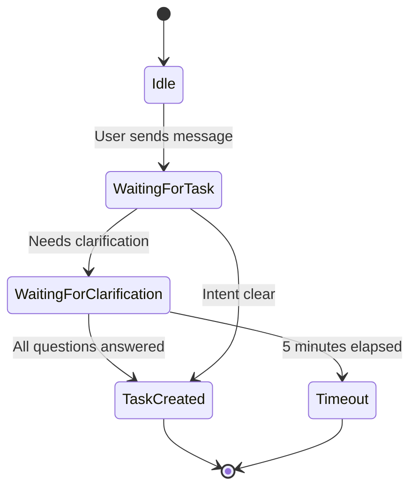

# FSM-Based Conversation Architecture

## Overview

Butler Bot uses Finite State Machine (FSM) for multi-turn conversations with users. This enables natural language task creation with clarification questions when inputs are ambiguous.

## State Diagram



## States

### TaskCreation.waiting_for_task

Initial state when user sends natural language input. The bot processes the text using `IntentOrchestrator` to extract task components (title, deadline, priority).

**Entry**: User sends `/task` command or natural language text

**Processing**:
- Parse text with `IntentOrchestrator.parse_task_intent()`
- Store partial intent in FSM context
- Check if clarification needed

**Exit Conditions**:
- `needs_clarification=False` → Transition to completion, clear state
- `needs_clarification=True` → Transition to `waiting_for_clarification`

### TaskCreation.waiting_for_clarification

State for collecting answers to clarifying questions when initial input is ambiguous (e.g., "tomorrow" without time, missing priority).

**Entry**: `IntentOrchestrator` detects missing required fields

**Processing**:
- Display first clarifying question from `result.questions`
- Store partial intent in FSM context
- Wait for user response

**Exit Conditions**:
- User provides clarification → Parse again, either complete or ask next question
- Timeout (5 minutes) → Clear state, notify user
- User cancels → Clear state

## Example Flows

### Example 1: Complete Intent (English)

```
User: "Call mom on 2025-12-01 15:00 high"
Bot: [Parses intent]
Bot: "✅ Task added: Call mom"
```

**State transitions**: `waiting_for_task` → [clear] (no clarification needed)

### Example 2: Requires Clarification (English)

```
User: "Remind me to call mom tomorrow"
Bot: [Parses intent, detects missing time]
Bot: "What is the deadline (date and time)?"
User: "2025-12-01 15:00"
Bot: "✅ Task added: Call mom"
```

**State transitions**: `waiting_for_task` → `waiting_for_clarification` → [clear]

### Example 3: Complete Intent (Russian)

```
User: "Купить молоко завтра в 15:00"
Bot: [Parses intent]
Bot: "✅ Задача добавлена: Купить молоко"
```

**State transitions**: `waiting_for_task` → [clear]

### Example 4: Multiple Clarifications (English)

```
User: "Add task"
Bot: "What should I name the task?"
User: "Buy groceries"
Bot: "What is the deadline (date and time)?"
User: "2025-12-01 15:00"
Bot: "✅ Task added: Buy groceries"
```

**State transitions**: `waiting_for_task` → `waiting_for_clarification` → `waiting_for_clarification` → [clear]

## Implementation Details

### FSM Storage

Uses aiogram's `MemoryStorage` for development/testing. In production, consider Redis storage for persistence across restarts.

### State Persistence

Partial intents are stored in FSM context as JSON-serializable dictionaries:

```python
{
    "partial_intent": {
        "title": "Call mom",
        "deadline_iso": None,
        "priority": "medium",
        "needs_clarification": True,
        "questions": ["When is the deadline?"]
    }
}
```

### Error Handling

- LLM unavailable: Stay in `waiting_for_task`, show error message
- Invalid intent: Re-ask with clearer prompt
- Timeout: Clear state after 5 minutes of inactivity

## Integration Points

- **IntentOrchestrator**: Parses natural language, determines clarification needs
- **MCP Tools**: Task creation via `add_task` tool
- **Telegram Bot**: Handlers in `src/presentation/bot/handlers/tasks.py`

## Future Enhancements

- Multi-turn clarification for multiple missing fields
- Context-aware parsing (remember user preferences)
- Redis FSM storage for production
- Conversation history tracking

